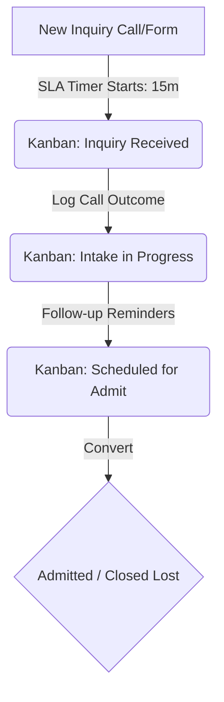

# Product Requirements Document (PRD)

## Project Name: AdmitFlowAI
**Document Version:** 1.1.0  
**Author:** AI Product Specialist  
**Status:** Approved (Scoping Finalized)  
**Date:** May 23, 2026  

---

## 1. Executive Summary

### 1.1. Product Vision
**AdmitFlowAI** is a lightweight, high-velocity admissions pipeline system tailored specifically for rehab and sober-living operators. It tracks every inquiry from the initial call to successful admission, implementing strict Service Level Agreements (SLAs), interactive scripts, and prompt follow-up reminders. 

By streamlining the intake pipeline and preventing leads from falling through the cracks, AdmitFlowAI helps operator teams maximize lead-to-admit conversion rates. A single recovered admission can yield more than the cost of the annual software subscription, presenting a clear, value-driven ROI for buyers.

### 1.2. Problem Statement
In the addiction treatment and sober-living space, intake leads are highly volatile. Prospective clients or family members calling for help are often in crisis. If a center does not answer immediately or fails to follow up within minutes, the lead moves to the next facility. Generic CRMs (like Salesforce or HubSpot) are over-engineered, slow to adapt, and fail to capture the specific urgency and intake flow of behavioral health. Consequently, valuable leads routinely fall through the cracks due to slow response times, lack of structured follow-ups, and disconnected communication paths.

### 1.3. Value Proposition
- **High-Velocity Intake:** Tailored specifically for the urgent cadence of rehab and sober-living intake.
- **SLA-Driven Workflows:** Strict visual and audible timers enforce response benchmarks (e.g., 15-minute contact SLA).
- **Zero-Knowledge HIPAA-Out-of-Scope Architecture:** Designed to keep operational costs low by client-side encrypting all human-identifiable information, utilizing anonymized trackers on the backend, thereby avoiding complex and expensive HIPAA compliance audits.
- **PWA Experience:** Fully installable mobile/desktop application with offline support and Web Push Notifications for SLA alerts.
- **Immediate ROI:** Reclaiming a single lost admission pays for the platform for multiple months.

---

## 2. Target Market & User Personas

| Persona | Role | Key Pain Points | Core Goals in AdmitFlowAI |
| :--- | :--- | :--- | :--- |
| **Owner-Operator / COO** | Business owner managing single/multi-site operations. | High cost of acquisition; lack of visibility into rep performance; lost revenue from dropped leads. | High-level analytics; daily/weekly conversion reports; rep accountability; cost-per-admit reduction. |
| **Admissions Director** | Oversees the intake team and handles complex escalations. | Hard to monitor response times in real-time; disjointed handoffs between reps; onboarding new reps is slow. | Real-time Kanban pipeline view; setting SLAs; assigning leads; reviewing daily admissions reports. |
| **Intake Specialist / Rep** | Handles first calls, follow-ups, and scheduling. | Task overload; forgetting who to call next; lack of structured call scripts in crisis moments. | Clear task checklists; SLA countdown visual cues; call disposition tagging; fast intake forms. |

---

## 3. Epics & Feature Scope

### 3.1. Phase 1: 1-Week MVP Scope (Core Foundations)
The objective of the 1-Week MVP is to establish the core visual pipeline, capture basic inquiry details, enforce lead response SLAs, and generate basic performance statistics.



#### F1. Anonymized Kanban Pipeline
*   **Description:** A responsive, drag-and-drop Kanban board showing lead cards organized by intake stages:
    1.  *Inquiry Received* (Fresh leads waiting for contact)
    2.  *Intake in Progress* (Initial contact made, gathering information)
    3.  *Verification of Benefits (VOB) Pending* (Insurance or payment coverage check)
    4.  *Scheduled for Admit* (Arrival date and transportation set)
    5.  *Admitted* (Goal state / Archive)
    6.  *Closed / Lost* (Lead disqualified or went elsewhere)
*   **Data Fields per Card:** Anonymized Lead ID (e.g., `AF-8492`), Encrypted Client Name, Assigned Rep, Lead Source, Creation Timestamp, Current Status, Last Contact Date, and Call Disposition Tag.

#### F2. Visual SLA Timers
*   **Description:** Configurable countdown timers visible on cards to enforce prompt action.
*   **Default Rules:**
    *   *Stage 1 (Inquiry Received):* 15-minute response timer.
    *   *Stage 3 (VOB Pending):* 4-hour follow-up timer.
*   **Visual Indicators:**
    *   `Fresh`: Green border.
    *   `Warning` (50% SLA remaining): Orange indicator.
    *   `Breached`: Red flashing banner with duration elapsed since breach.

#### F3. Call Disposition Dropdowns & Action Tags
*   **Description:** Quick-tag system to categorize the outcome of every touchpoint.
*   **Pre-defined Options:**
    *   `Spoke to Lead`
    *   `Spoke to Family Member`
    *   `No Answer - Left Voicemail`
    *   `Busy / Call Back Scheduled`
    *   `Not a Fit (Disqualified)`
    *   `Needs Higher Level of Care`

#### F4. PWA Integration (Installability & Local Decryption)
*   **Description:** The web app runs as an installable Progressive Web App (PWA) with offline capabilities.
*   **Key Features:**
    *   Web App Manifest (`manifest.json`) and service worker configuration.
    *   Local key-entry dashboard: Rep enters a workspace passkey on login which is saved in session memory to decrypt lead names on their device.
    *   Local Notification API triggers to alert reps of SLA breaches even when the tab is running in the background.

#### F5. Non-PHI Task Reminders
*   **Description:** Simple checklists inside each lead detail modal to prompt the next immediate action (e.g., "Confirm transportation pickup time").
*   **Rule:** Strict character filter or warning placeholder on task text fields prohibiting the entry of dates of birth, medical symptoms, diagnosis codes, or insurance policy IDs.

#### F6. Daily Admissions Report (Email / Dashboard Widget)
*   **Description:** A daily automated summary sent to the owner-operator or Admissions Director at 6:00 PM local time.
*   **Metrics:** Total inquiries received, total admits, lost lead distribution (by reason), and percentage of leads that breached SLA response times.

---

### 3.2. Phase 2: 30-Day Extended Scope
The 30-Day scope expands the single-user pipeline into a multi-site, multi-role communication hub with detailed marketing attribution and basic automation.

#### F7. Multi-User Roles & Permissions
*   **Super Admin / Owner:** Full access to all locations, monetization details, reports, and user configuration.
*   **Admissions Director:** Can configure SLAs, assign tasks, view team reports, and reassign leads.
*   **Intake Specialist:** Can create leads, update card status, log calls, and view personal task queue.

#### F8. Marketing Source Attribution
*   **Description:** Captures the origin of every lead (e.g., Google Ads, Organic SEO, Helpline, Alumni Referral, Local Consultant) to compute ROI on marketing spend.
*   **Analytics:** Conversion rate breakdown by channel (e.g., "Google Ads converting at 8.2% vs SEO at 14.5%").

#### F9. Missed-Call Routing & Integration
*   **Description:** Integrates with basic VoIP webhooks (e.g., Twilio or Dialpad).
*   **Functionality:** If a call to the main intake line is missed, AdmitFlowAI automatically creates a card in the "Inquiry Received" column with a high-priority "Missed Call" tag, triggering Web Push alerts.

#### F10. Web Push Notification Service
*   **Description:** Push notifications sent via service workers to devices when leads breach SLAs or tasks are assigned, even if the browser is entirely closed.

#### F11. Canned Email & SMS Outreach (No-PHI Templates)
*   **Description:** Quick-copy or automated templates for rapid follow-ups.
*   **Templates:**
    *   "Follow-up: Just missed you, please call us back when you are ready."
    *   "Directions & Logistics: Here is the address and what to pack for arrival."
*   **Restriction:** The system automatically strips any dynamic variables containing medical content.

#### F12. Pipeline Conversion Analytics
*   **Description:** A reporting dashboard with visual charts illustrating:
    *   *Intake Funnel:* Conversion drop-off rates from Stage 1 through Stage 5.
    *   *SLA Compliance:* Rep-by-rep compliance metrics.
    *   *Average Time-to-Admit:* Duration elapsed between initial inquiry and admission.

---

## 4. Compliance & HIPAA Avoidance Strategy

> [!IMPORTANT]
> To remain outside the scope of heavy HIPAA compliance audits, AdmitFlowAI **MUST NOT** store or transmit Protected Health Information (PHI) in readable formats under any circumstances.

### 4.1. HIPAA Avoidance Architecture
The system operates as an **operational pipeline tool**, not a clinical Electronic Health Record (EHR). We utilize a **Zero-Knowledge Client-Side Encryption** architecture to manage user identity:

1.  **Zero-Knowledge Client-Side Encryption:**
    *   When a new lead is created, the patient's name, phone number, and sensitive identifiers are encrypted directly in the client browser using the Web Crypto API (AES-GCM-256) with a site-wide passphrase known only to the operator.
    *   The database ONLY receives and stores the base64 ciphertext (e.g., `U2FsdGVkX194RjNmQ0Q5M2F...==",`). The server has no mechanism to decrypt this data, meaning the hosting server and developers are completely outside the scope of PHI custody.
    *   On load, the client browser decrypts the lead info locally in memory using the passphrase stored in `sessionStorage`.
2.  **No Clinical Notes:**
    *   Do **NOT** provide text fields for diagnosis, drug of choice, medical history, psychiatric evaluations, or medication lists.
    *   *Solution:* Use strict drop-down options for non-clinical status tracking, e.g., "Substance Type: Alcohol / Substance / Mental Health" (broad categories only) or "Level of Care: Residential / IOP / Sober Living".
3.  **No Insurance Details:**
    *   Do **NOT** collect insurance policy numbers or group numbers.
    *   *Solution:* The VOB stage is represented simply by a binary flag (`VOB Complete: Yes/No`) and an outcome tag (`VOB Approved`, `VOB Denied`, `Out of Network`).
4.  **UI Warnings:**
    *   Banners at the top of note-taking areas reminding reps: *"Do not enter PHI (names, SSNs, DOBs, medical details). Use this space strictly for logistical scheduling."*
5.  **Automated Scrubbing Engine:**
    *   Implement regex filters and lightweight client-side pattern-matching to reject entries matching formats for DOB (e.g., `MM/DD/YYYY`), SSN (`XXX-XX-XXXX`), or common insurance prefix combinations.

---

## 5. Technical Specifications

### 5.1. Tech Stack
*   **Frontend:** Next.js (App Router) + TypeScript.
*   **Styling:** Vanilla CSS with HSL-based color tokens, modern layouts (CSS Grid, Flexbox), and glassmorphic dashboard panels to deliver a premium, responsive visual aesthetic.
*   **Database:** Cloud Firestore (real-time sync of pipeline status).
*   **Authentication:** Firebase Auth (providing multi-tenant role-based access control).
*   **Hosting:** Firebase App Hosting or Classic Firebase Hosting.
*   **PWA Assets:** `manifest.json` registration, service worker registration (`/public/sw.js`), and Web Notifications API support.

### 5.2. MVP Core Data Model (Zero-Knowledge)
```json
{
  "leadId": "AF-98431",
  "createdAt": "2026-05-23T22:15:00Z",
  "updatedAt": "2026-05-23T22:18:30Z",
  "status": "vob_pending",
  "assignedRepId": "rep_102",
  "source": "google_ads",
  "lastContactTimestamp": "2026-05-23T22:18:00Z",
  "disposition": "spoke_to_family",
  "slaDeadline": "2026-05-24T02:15:00Z",
  "slaStatus": "warning",
  "encryptedPayload": {
    "ciphertext": "U2FsdGVkX194RjNmQ0Q5M2F...==",
    "iv": "d3FhZDM0NTY3OGkxMjM0NQ=="
  },
  "tasks": [
    {
      "taskId": "task_1",
      "todo": "Confirm transportation pickup time",
      "completed": false
    }
  ],
  "logisticalNotes": "Needs transportation from airport terminal A on Friday evening. No clinical history discussed."
}
```

---

## 6. Design & User Experience Guidelines

To match a modern, premium SaaS feel:
*   **Visual Philosophy:** Sleek, high-contrast dashboard with dark mode layout options. Glassmorphism paneling (`backdrop-filter: blur()`) for modal dialogs and settings overlays.
*   **Typography:** Google Font `Outfit` or `Inter` for clean, professional data presentation.
*   **Micro-Animations:**
    *   Smooth transition when dragging cards between columns (`transition: transform 0.2s ease`).
    *   Subtle pulsing gradient rings around cards nearing their SLA breach threshold.
    *   Hover state highlights for action buttons and card details.

---

## 7. Key Metrics for Success
1.  **Lead-to-Admit Conversion Rate:** Percentage of incoming inquiries that move successfully to the "Admitted" stage.
2.  **SLA Breach Percentage:** The proportion of new inquiries that fail to be contacted within the 15-minute window.
3.  **Average Response Time:** Time elapsed from lead insertion to first call disposition update.
4.  **Chamber Velocity:** The average number of days a lead spends in stages 2-4 before final resolution.
